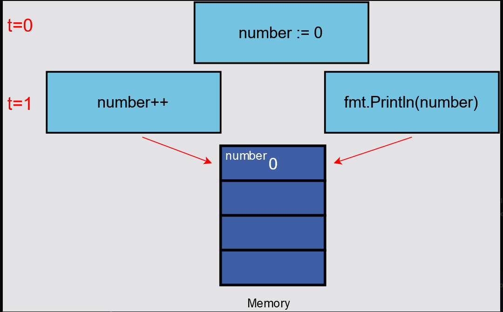
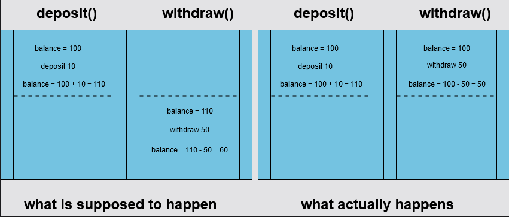
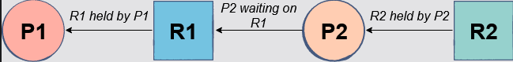
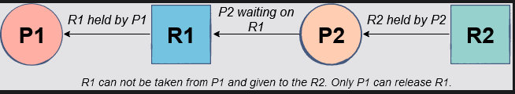
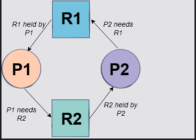
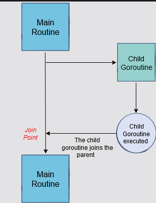

## What is concurrency?

- Concurrency, by definition, is the ability to break down a computer program or algorithm into individual parts, which can be executed independently. The final outcome of a concurrent program is the same as that of a program which has been executed sequentially. Using concurrency, we are able to achieve the same results in lesser time, thus increasing the overall performance and efficiency of our programs.
- The trick with writing concurrent programs is to ensure the correctness of your program yourself. Therefore, keep in mind that all the individual chunks of your concurrent program should be executed independently and have access to the shared memory i.e. they can read from or write to the same memory location. Also, you need to take care of the allocation of resources so that no process starves due to a lack of resources. In addition, you will have to synchronize and coordinate between processes so that you can prevent a deadlock if they are dependent on each other.


## Cocnurrency Vs. Parallelism

- Concurrency is about dealing lots of things at once. Concurrency is about the structure.
- Parallelism is about doing lots of things at once.Parallerlism is about execution.
- When we say that parallelism is about the execution of tasks that are independent of each other, we first need to create these independent tasks through concurrency. That is what we do when we design and structure a big problem into smaller problems which can be solved independently. Concurrency will ensure that these independent tasks are able to coordinate and synchronize with each other such that we get the correct final result. Therefore concurrency has to be there for parallelism to exist.
- A famous talk on [concurrency is not parallelism](https://go.dev/blog/waza-talk).
- A paper on [Communicating Sequential Processes](https://dl.acm.org/doi/10.1145/359576.359585) by Tony Hoare, written in 1978.

***"Don’t communicate by sharing memory; share memory by communicating."***

## Data Race

- One of the reasons why concurrency is hard to achieve is because of data races.
- A data race happens when processes have to access the same variable concur­rently i.e. one process reads from a memory location while another simultaneously writes to the exact same memory location.

```go
package main
import "fmt"

func main() {
    number := 0;
    
    go func(){
      number++ //reading and modifying the value of 'number'
    }()

    fmt.Println(number) //reading the value of 'number'

}
```



## Race Condition

A race condition is flaw in a program regarding the timing/ordering of operations which disrupts the logic of the program and leads to erroneous results.

```go
package main

import "fmt"

func deposit(balance *int, amount int) {
	*balance = +amount
}

func withdraw(balance *int, amount int) {
	*balance = -amount
}

func main() {
	balance := 100

	go deposit(&balance, 10)

	withdraw(&balance, 50)

	fmt.Println("balance", balance)

}
```




***"Go has its own data race detector."***

In Go, we can avoid data races by using channels or locks. They will allow us to synchronize memory access to all shared mutable data.


## Deadlocks

A deadlock occurs when all processes are blocked while waiting for each other and the program cannot proceed further.

## Coffman Conditions

There are four conditions, known as the Coffman Conditions, that must be present simultaneously for a deadlock to occur:

- Mutual Exclusion - A concurrent process holds at least one resource at any one time making it non-sharable.

- Hold And Wait - A concurrent process holds a resource and is waiting for an additional resource.

- No Preemption - A resource held by a concurrent process cannot be taken away by the system. It can only be freed by the process holding it.

- Circular Wait -  A concurrent process must be waiting on a chain of other concurrent processes such that P1 is waiting on P2, P2 on P3, and so on, and there exists a Pn which is waiting on P1. This forms a circular loop.


***Go can detect deadlocks at runtime.***
```go
package main
import "fmt"

func main() {
	mychannel := make(chan int)
	mychannel <- 10
	fmt.Println(<-mychannel)
}
fatal error: all goroutines are asleep - deadlock!

goroutine 1 [chan send]:
main.main()
    /usercode/main.go:6 +0x62
exit status 2
```
This is because the program is stuck on sending a value to the channel: mychannel <- 10. The sending operation is a blocking operation and requires the receive channel to be ready before sending data to the channel.

```go
package main
import "fmt"

func main() {
	mychannel := make(chan int)
	go func(){
		mychannel <- 10
	}()
	fmt.Println(<-mychannel)
}
```

Bear in mind that Go only detects deadlocks when the program is stuck as a whole and not when a few of the goroutines are blocked. Also, goroutines are mostly blocked while waiting for a channel operation or for the locks which belong to the sync package. Have a look at an example below:

```go

package main
import "fmt"

func main() {
	mychannel1 := make(chan int)
	mychannel2 := make(chan int)
	mychannel3 := make(chan int)
	go func(){
		<-mychannel1
	}()

	go func(){
		mychannel2 <- 20
	}()

	go func(){
		<-mychannel3 
	}()


	fmt.Println(<-mychannel2)
}

# output = 20
```

As you can see from the code above, the first and the third goroutine are blocked because there is no send operation that sends to these channels. Still, the program executes successfully and we don’t get any deadlock error as it only occurs when the program is stuck as a whole.

## Starvation

Starvation happens when a process is deprived of necessary resources and is unable to complete its function.

## Goroutines

### The Fork-Join Model

Go uses the idea of the fork-join model of concurrency behind goroutines. The fork-join model essentially implies that a child thread/process splits from its parent thread/process to run concurrently with the parent process. After completing its execution, the child process merges back into the parent process. The point where it joins back is called the join point. Goroutines work in a similar fashion. Sometimes you won’t have a join point in your program, for example, in cases where goroutines only print onto the console and exit. On the other hand, if you’ll have a join point, you’ll have to synchronize your goroutine with the rest of the program.



***Goroutines are not necessarily running in parallel!***
***All goroutines have the same address space***
***Goroutines as light-weight threads***

## Channels

- A channel is a pipe between goroutines to synchronize execution and communicate by sending/receiving data.

- 